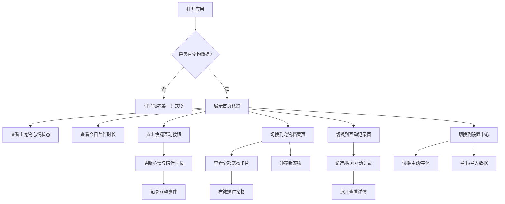

## 1. 产品概述

「圆嘟嘟宠物档案」是一款电子宠物陪伴 Web 应用，用户可以领养和管理多种圆嘟嘟风格的电子宠物（小猫、小狗、小猪等），通过每日互动陪伴宠物成长，获取情绪价值。

- **核心目标**：打造可爱治愈的电子宠物陪伴体验，通过每日互动激励用户养成打开习惯
- **目标用户**：喜欢可爱事物、需要情绪陪伴、养成类游戏爱好者
- **产品价值**：轻量化的情绪陪伴工具，无需复杂操作即可获得治愈感

## 2. 核心功能

### 2.1 用户角色

| 角色 | 注册方式 | 核心权限 |
|------|----------|----------|
| 普通用户 | 无需注册，本地存储 | 领养宠物、互动、查看档案、设置偏好 |

### 2.2 功能模块

1. **首页概览**：主宠物展示、实时心情、今日陪伴时长、连续签到、快捷互动入口
2. **宠物档案**：宠物卡片网格、右键菜单、成长曲线图表、领养新宠物
3. **互动记录**：事件时间线、筛选搜索、详情展开
4. **设置中心**：主题切换、字体大小、数据导入导出、清除数据

### 2.3 页面详情

| 页面名称 | 模块名称 | 功能描述 |
|----------|----------|----------|
| 首页概览 | 主宠物展示 | 大号圆嘟嘟宠物形象、昵称、等级、品种 |
| 首页概览 | 心情状态面板 | 环形进度条 + 表情图标、悬停显示最近互动 |
| 首页概览 | 签到与时长 | 今日陪伴时长、连续签到天数 |
| 首页概览 | 快捷互动 | 喂食、抚摸、冒险、睡前模式四个快捷按钮 |
| 宠物档案 | 宠物卡片网格 | 展示全部已领养宠物，含品种、昵称、等级、心情 |
| 宠物档案 | 右键菜单 | 设为主宠物、编辑昵称、查看成长曲线 |
| 宠物档案 | 成长曲线 | 近 7 日心情均值与陪伴时长折线图 |
| 宠物档案 | 领养入口 | 从品种库选择新宠物领养 |
| 互动记录 | 事件流 | 按时间倒序展示互动事件 |
| 互动记录 | 筛选搜索 | 按品种、事件类型筛选，关键词搜索昵称 |
| 互动记录 | 详情展开 | 点击记录查看详情（如冒险贴纸） |
| 设置中心 | 主题切换 | 浅色/深色主题 |
| 设置中心 | 字体大小 | 三档字体调节 |
| 设置中心 | 数据管理 | 导出/导入 JSON、清除全部数据（二次确认） |

## 3. 核心流程

### 3.1 主要用户流程

用户打开应用 → 查看首页主宠物状态 → 进行互动（喂食/抚摸/冒险/睡前）→ 心情值变化 → 陪伴时长增加 → 查看互动记录 → 管理宠物档案 → 设置个性化偏好

### 3.2 流程图

## 4. 用户界面设计

### 4.1 设计风格

- **主色调**：柔和粉色系（#FFB6C1）+ 天蓝色（#87CEEB），pastel 马卡龙配色
- **辅助色**：淡紫色（#DDA0DD）、薄荷绿（#98FB98）、奶油黄（#FFFACD）
- **圆角风格**：超大圆角（20-24px），圆嘟嘟可爱风格
- **字体**：使用圆润可爱的无衬线字体（如 'Nunito' 或 'Quicksand'）
- **卡片风格**：柔和阴影 + 渐变背景 + 毛玻璃质感
- **图标风格**：可爱圆润 emoji + Lucide 图标组合
- **动效**：弹性缓动动画、悬停放大效果、脉冲呼吸动画

### 4.2 页面设计概览

| 页面名称 | 模块名称 | UI 元素 |
|----------|----------|---------|
| 首页概览 | 主宠物展示 | 圆形渐变背景 + 宠物 emoji 大图标 + 昵称标签 |
| 首页概览 | 心情状态 | SVG 环形进度条 + 中央表情图标 + tooltip |
| 首页概览 | 签到卡片 | 渐变色卡片 + 火焰图标 + 天数数字 |
| 首页概览 | 快捷按钮 | 四个圆角图标按钮 + 悬停上浮动效 |
| 宠物档案 | 宠物卡片 | 网格布局，每张卡片含宠物头像、昵称、等级、心情条 |
| 宠物档案 | 右键菜单 | 弹出式菜单，柔和阴影，选项带图标 |
| 宠物档案 | 成长曲线 | Chart.js 折线图，双色折线（心情+时长） |
| 互动记录 | 事件流 | 时间线布局，左侧时间点 + 右侧事件卡片 |
| 设置中心 | 设置项 | 分组卡片，开关/选择器/按钮 |

### 4.3 响应式

- **桌面端优先**：1200px 以上最佳体验
- **平板适配**：768px 以上，网格列数自适应
- **移动端适配**：375px 以上，单列布局，底部导航栏
- **触摸优化**：按钮最小尺寸 44x44px，间距适配手指操作

### 4.4 空状态与错误处理

- 无宠物时显示可爱空状态插画 + 引导领养按钮
- 无互动记录时显示空状态文案
- 本地数据损坏时显示友好提示 + 重置选项
- 加载时显示骨架屏或脉冲动画
