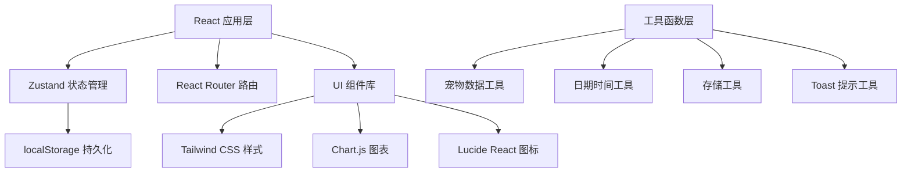
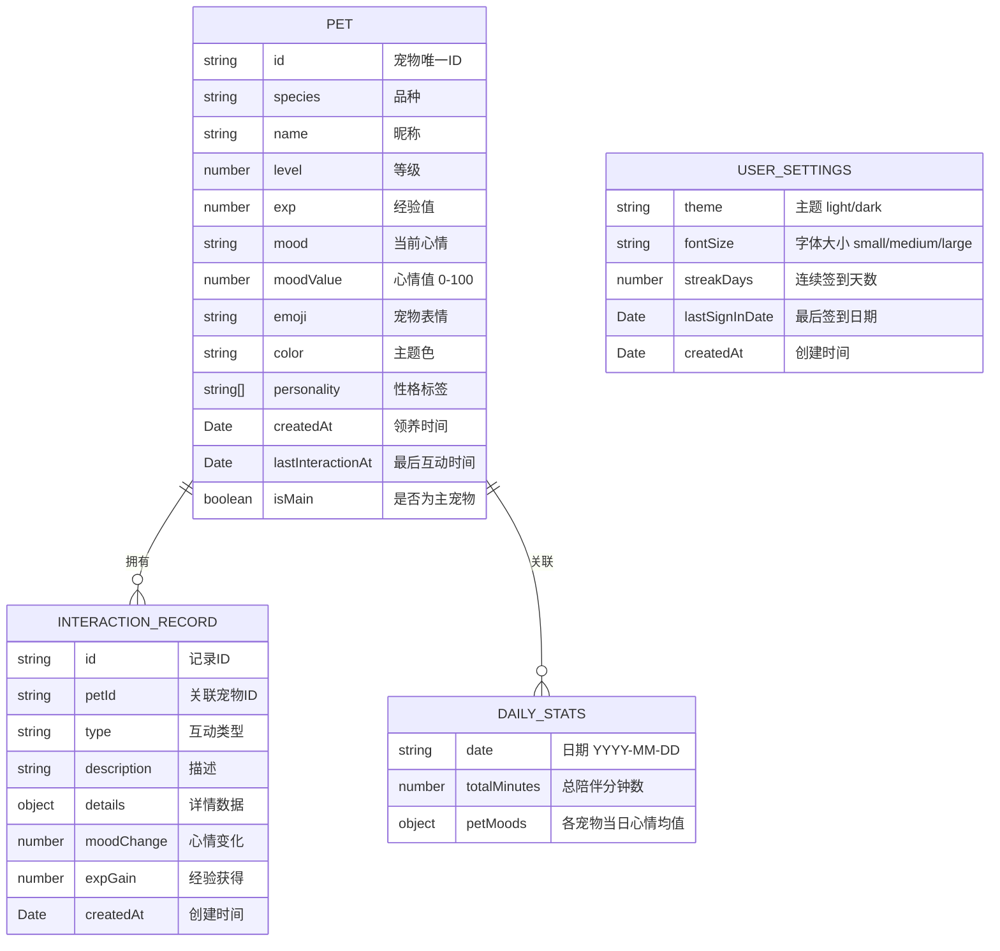

## 1. 架构设计



## 2. 技术描述

- **前端框架**：React 18 + TypeScript
- **构建工具**：Vite 5
- **路由管理**：React Router DOM 6
- **状态管理**：Zustand 4
- **样式方案**：Tailwind CSS 3
- **图表库**：Chart.js 4 + react-chartjs-2
- **图标库**：Lucide React
- **数据持久化**：localStorage
- **代码规范**：TypeScript 严格模式

## 3. 路由定义

| 路由路径 | 页面名称 | 说明 |
|----------|----------|------|
| / | 首页概览 | 默认首页，展示主宠物状态 |
| /pets | 宠物档案 | 宠物卡片网格与管理 |
| /records | 互动记录 | 互动事件时间线 |
| /settings | 设置中心 | 个性化设置与数据管理 |

## 4. 数据模型

### 4.1 数据模型定义



### 4.2 宠物品种预设

| 品种 | emoji | 主题色 | 性格标签 |
|------|-------|--------|----------|
| 小猫 | 🐱 | #FFB6C1 | 傲娇、爱干净 |
| 小狗 | 🐶 | #87CEEB | 忠诚、活泼 |
| 小猪 | 🐷 | #FFC0CB | 贪吃、憨厚 |
| 小兔 | 🐰 | #DDA0DD | 胆小、可爱 |
| 小熊 | 🐻 | #DEB887 | 温暖、可靠 |
| 小狐 | 🦊 | #FFA07A | 聪明、狡黠 |

### 4.3 心情状态

| 心情 | emoji | 心情值范围 |
|------|-------|------------|
| 开心 | 😊 | 70-100 |
| 平静 | 😌 | 40-69 |
| 想玩 | 🎾 | 50-69 且非困倦 |
| 困倦 | 😴 | 0-39 或晚间 |

### 4.4 互动类型

| 类型 | 说明 | 心情变化 | 经验获得 |
|------|------|----------|----------|
| feed 喂食 | 给宠物喂食 | +15 | +10 |
| pet 抚摸 | 抚摸宠物 | +10 | +5 |
| adventure 冒险 | 发起冒险 | +20 | +25 |
| bedtime 睡前 | 进入睡前模式 | +5，然后下降 | +8 |
| play 玩耍 | 玩耍互动 | +12 | +12 |

## 5. 项目结构

```
src/
├── components/          # 通用组件
│   ├── Layout/         # 布局组件
│   │   ├── Header.tsx
│   │   ├── Navigation.tsx
│   │   └── Container.tsx
│   ├── PetCard/        # 宠物卡片
│   ├── MoodRing/       # 心情环形进度条
│   ├── Toast/          # Toast 提示
│   ├── Skeleton/       # 骨架屏
│   ├── Modal/          # 弹窗
│   └── EmptyState/     # 空状态
├── pages/              # 页面组件
│   ├── Home.tsx
│   ├── Pets.tsx
│   ├── Records.tsx
│   └── Settings.tsx
├── store/              # 状态管理
│   └── usePetStore.ts
├── hooks/              # 自定义 Hooks
│   ├── useLocalStorage.ts
│   ├── useToast.ts
│   └── useMood.ts
├── utils/              # 工具函数
│   ├── storage.ts
│   ├── date.ts
│   ├── pet.ts
│   └── validation.ts
├── types/              # TypeScript 类型
│   └── index.ts
├── data/               # 静态数据
│   └── species.ts
├── App.tsx
├── main.tsx
└── index.css
```

## 6. 状态管理设计

### 6.1 Zustand Store

```typescript
interface PetStore {
  pets: Pet[];
  records: InteractionRecord[];
  dailyStats: DailyStats[];
  settings: UserSettings;
  isLoading: boolean;
  error: string | null;
  
  // 宠物操作
  adoptPet: (speciesId: string, name: string) => void;
  setMainPet: (petId: string) => void;
  updatePetName: (petId: string, name: string) => void;
  getMainPet: () => Pet | undefined;
  getPetById: (petId: string) => Pet | undefined;
  
  // 互动操作
  interact: (petId: string, type: InteractionType, details?: object) => void;
  
  // 统计操作
  getTodayStats: () => { minutes: number; streak: number };
  getWeeklyMoodData: (petId: string) => ChartData;
  
  // 设置操作
  updateSettings: (partial: Partial<UserSettings>) => void;
  exportData: () => string;
  importData: (json: string) => boolean;
  clearAllData: () => void;
  
  // 存储操作
  loadFromStorage: () => void;
  saveToStorage: () => void;
}
```

## 7. 健壮性设计

1. **localStorage 异常处理**
   - 数据损坏时捕获 JSON parse 错误
   - 提供数据重置选项
   - 存储容量不足时提示

2. **空数据处理**
   - 所有列表组件支持空状态
   - 图表无数据时显示引导文案
   - 主宠物不存在时引导领养

3. **输入验证**
   - 昵称长度限制
   - 导入数据格式校验
   - ID 唯一性检查

4. **错误边界**
   - React Error Boundary 包裹页面
   - 错误时显示友好提示而非白屏
